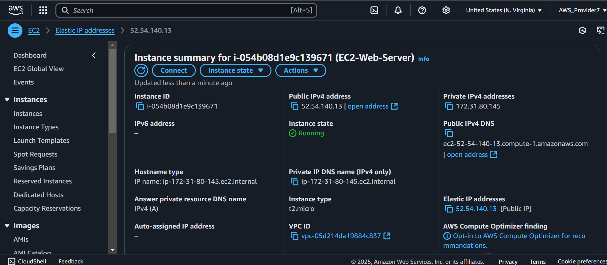
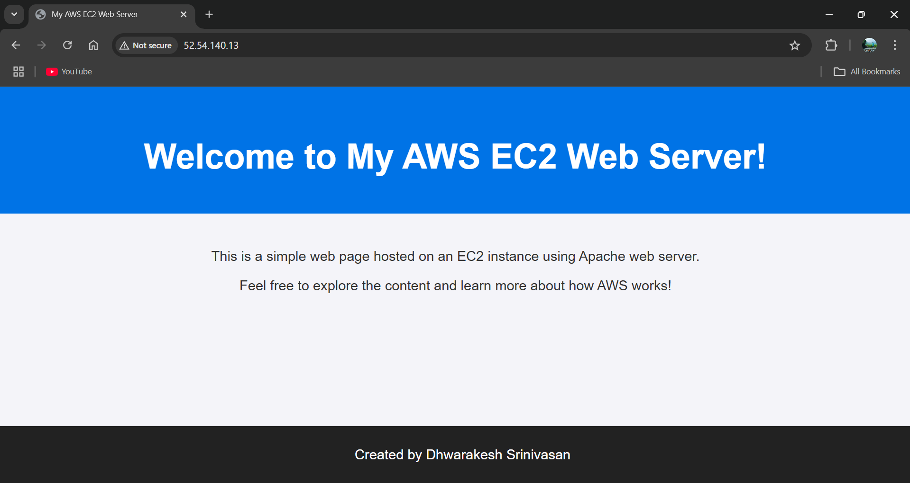

# 🚀 Deploying a Web Server on AWS EC2  

[](https://aws.amazon.com)  
[](https://httpd.apache.org)  

A simple web server hosted on AWS EC2 using Apache.  

Copy and paste the following link in your browser to view the web server :

`http://52.54.140.13`


## 🌟 Features  
- **EC2 Instance**: t2.micro (Free Tier).
- **Elastic IP**: Providing stable live link to the web server. 
- **Apache Web Server**: Hosting a static HTML page.  
- **Security**: Restricted SSH access to the IP.  

## 📸 Screenshots  
### 1. EC2 Instance in AWS Console  
  
*An EC2 instance has been created and is running*


### 2. Apache Service Status  
  
*The output for sudo systemctl status httpd, showing the status as running*


### 3. Website Demo  
  
*A screenshot of the successfully running web server*


## 🛠️ Technologies Used  
- **AWS EC2**: Virtual server hosting.  
- **Apache**: Web server software.  
- **SSH**: Secure remote access.  

## 🚀 How to Run  
1. **Launch an EC2 Instance**:  
   - AMI: Amazon Linux 2, Instance Type: t2.micro.  
   - Security Group: Allow SSH (Port 22) and HTTP (Port 80).  
2. **Connect via SSH**:  
   ```bash  
   ssh -i "your-key.pem" ec2-user@<public-ip>  
   ```
3. **Install Apache**:
```bash
   sudo yum install httpd -y  
   sudo systemctl start httpd
```
4. **Host a Website**:
```bash
Create /var/www/html/index.html → Test at http://<public-ip>.
```

**Note**:
Maintaining a live, secure (HTTPS-enabled) web server typically incurs additional costs, such as purchasing a domain, using an Elastic IP, and configuring DNS management with Route 53. Therefore, this web server is set up with HTTP functionality only for demonstration purposes.

👨💻 Author:  
  **Dhwarakesh Srinivasan**
