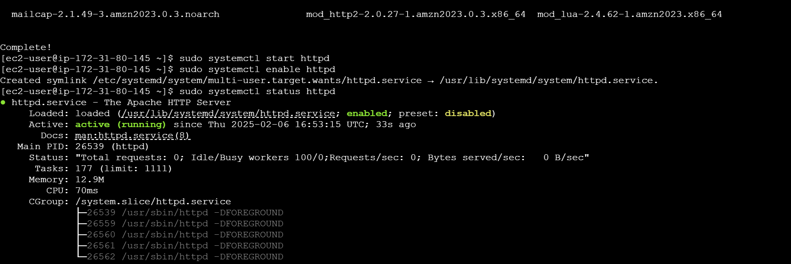

# 🚀 Deploying a Web Server on AWS EC2  

[](https://aws.amazon.com)  
[](https://httpd.apache.org)  

A simple web server hosted on AWS EC2 using Apache.  

## 🌟 Features  
- **EC2 Instance**: t2.micro (Free Tier).  
- **Apache Web Server**: Hosting a static HTML page.  
- **Security**: Restricted SSH access to your IP.  

## 📸 Screenshots  
### 1. EC2 Instance in AWS Console  
  

### 2. Apache Service Status  
  

### 3. Website Demo  
  

## 🛠️ Technologies Used  
- **AWS EC2**: Virtual server hosting.  
- **Apache**: Web server software.  
- **SSH**: Secure remote access.  

## 🚀 How to Run  
1. **Launch an EC2 Instance**:  
   - AMI: Amazon Linux 2, Instance Type: t2.micro.  
   - Security Group: Allow SSH (Port 22) and HTTP (Port 80).  
2. **Connect via SSH**:  
   ```bash  
   ssh -i "your-key.pem" ec2-user@<public-ip>  
